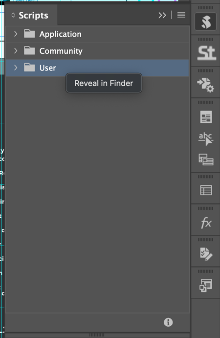
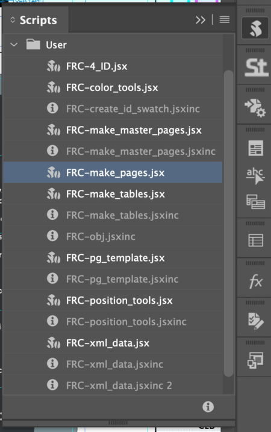

# Using the FRC Script Library

### What is the FRC Script Libary?  
A set of programs and scripts that provide automation and additional utility for the Fource Sign team. It is a mix of two Javascript dialects, vanilla Javascript and Extendscript.  

### Using the Book Automator  
1. Navigate to the following path in the /company directory of the server:  
```
'/Volumes/company/Signs/Multi Use 2.0/0-Approved/~Sign Library/99-Data/00-scripts'
```
2. Jump to your local scripts folder by right-clicking the __User__ folder in your scripts panel and hitting "Reveal in Finder"


```
'/Users/YOUR_USER_NAME_HERE/Library/Preferences/Adobe InDesign/Version 20.0/en_US/Scripts/Scripts Panel'
```

3. Open this template on the server:  
Note - the scripts will not work on anything other than a designated template. 
```
'/Volumes/company/Signs/Multi Use 2.0/0-Approved/~Sign Library/99-Data/00-automated_templates/Sign_Book_Template-09S.indt'
```
4. Click File -> Import XML. Load the XML file that corresponds with your contract from here: 
```
'/Volumes/company/Signs/Multi Use 2.0/0-Approved/~Sign Library/99-Data/xml_lib'
```
4. Run the __FRC-make_pages.jsx__ script from your Scripts Panel:  



5. Answer any of the dialogues of the script as they appear, it should leave you with a book that has basic page layouts and tables that correspond with the contract you chose. 

